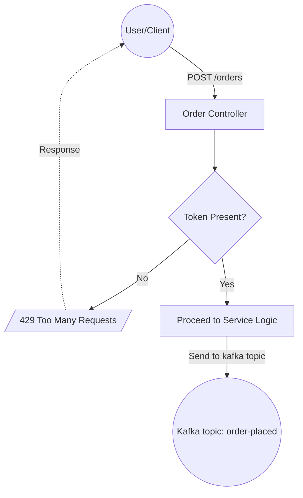

# Simple kafka order service
## Architecture

### Core
The service will expose a rest endpoint, which can be used to place an order,
which further sends a message to order-place topic.

### Rate limiting
This service will use token bucket algorithm to ensure rate limiting to prevent
system overload. The tokens will be refreshed from time to time.
